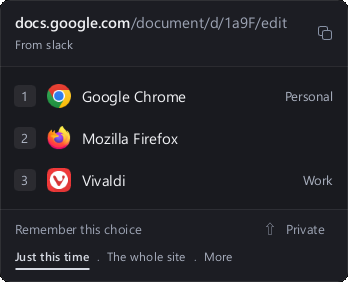
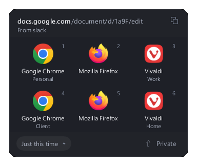
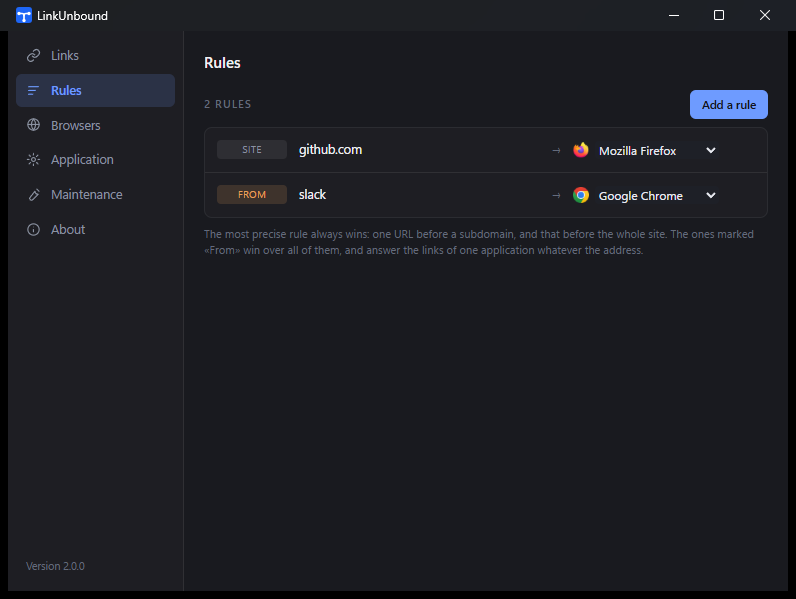

<div align="center">


# LinkUnbound

**A free, open source browser picker for Windows and macOS. Choose which browser opens every link.**

**Open source. Local-first. Privacy-first. Zero telemetry.**

<p>
  <a href="https://github.com/rgdevment/LinkUnbound/actions/workflows/ci.yml">
    
  </a>
  <a href="https://sonarcloud.io/summary/overall?id=rgdevment_LinkUnbound">
    
  </a>
  <a href="https://github.com/rgdevment/LinkUnbound/actions/workflows/mutants-sweep.yml">
    
  </a>
  <a href="https://dashboard.stryker-mutator.io/reports/github.com/rgdevment/LinkUnbound/main">
    
  </a>
  <a href="https://sonarcloud.io/summary/overall?id=rgdevment_LinkUnbound">
    
  </a>
  <a href="https://github.com/rgdevment/LinkUnbound/releases">
    
  </a>
  
  
  <a href="#license">
    
  </a>
  <a href="https://github.com/sponsors/rgdevment">
    
  </a>
  <a href="https://buymeacoffee.com/rgdevment">
    
  </a>
</p>

<p>
  
  &nbsp;
  
</p>
<p>
  
</p>

<h4>Download LinkUnbound</h4>

<p align="center">
  <a href="https://apps.microsoft.com/detail/9N9F7C8Q43KC">
    
  </a>
  &nbsp;
  <a href="#getting-started">
    
  </a>
</p>

<p align="center">
  <a href="https://github.com/rgdevment/LinkUnbound/releases">
    
  </a>
  &nbsp;
  <a href="https://github.com/rgdevment/LinkUnbound/releases">
    
  </a>
</p>

<p align="center">
  <sub>Prefer a direct download? <a href="https://github.com/rgdevment/LinkUnbound/releases/latest">GitHub Releases</a> has standalone installers — Windows (.exe) · macOS (.dmg)</sub>
</p>

</div>

---

**LinkUnbound** is a free, open source **browser picker**, **browser chooser** and **default browser manager** for Windows and macOS. Every link you click — in Teams, Outlook, Slack, Discord, a PDF, an email client, wherever — gets intercepted. If there's a domain rule, the assigned browser opens instantly. If not, a small **browser selection popup** appears next to your cursor so you can pick the right browser for that link.

Think of it as a lightweight **link router** / **URL router** and **browser switcher** that sits between your operating system and your browsers. Perfect for separating **work and personal browsing**, routing client domains to specific browser profiles, or handling multiple browsers without changing the system default every time.

This isn't a company product or a startup. I'm a solo developer who got tired of the OS deciding which browser opens a link, built this for myself, and decided to share it with the community. **No ads, no telemetry, no analytics, no accounts, no subscriptions, no cloud, no data collection.** Just a small native tool that lives on your machine and nowhere else.

---

## Table of Contents

- [What It Does](#what-it-does)
- [What It Is / What It Isn't](#what-it-is--what-it-isnt)
- [Privacy and Security](#privacy-and-security)
- [Getting Started](#getting-started)
- [How It Works](#how-it-works)
- [Domain Rules](#domain-rules)
- [Architecture](#architecture)
- [FAQ](#faq)
- [Localization](#localization)
- [Want to Help?](#want-to-help)
- [Support the Project](#support-the-project)
- [Other Tools](#other-tools)
- [License](#license)

---

## What It Does

- **Registers as default browser** — intercepts every link click system-wide on Windows and macOS
- **Shows a floating picker** near your cursor, in two looks: a classic list or a mosaic of tiles. Pick with the mouse or the keys `1`–`9`; hold **Shift** for a private window; `Ctrl+C` copies the address; `Esc` puts it away
- **Remembers the choice at the reach you pick** — this URL, this subdomain, the whole site, or everything a given app sends
- **Rules from Settings too** — a rule for a site you have not visited yet, or for an app, without waiting for the picker
- **Unwraps Microsoft SafeLinks** and the Edge-only scheme Teams and Outlook wrap links in, so rules see the real destination
- **Tells you when a rule decided** — a small notice with an Undo, six seconds, no focus taken
- **Opens local documents** when you choose it for them — `.html`, `.pdf` and the rest on Windows, `.html` and `.xhtml` on macOS
- **Runs silently** in the system tray (or menu bar on macOS) — starts at sign-in, stays out of the way
- **Detects installed browsers** and their Chromium profiles — or add custom ones manually
- **Opens in a private window** using the switch each browser family expects
- **Updates itself** — looks at the release feed in the background, says so in the picker and in Settings, and one press installs it; a Microsoft Store copy updates through the Store
- **Tells you when links are not arriving** — Settings explains why and offers the repair
- **Two languages, three themes** — English and Spanish with automatic detection; light, dark or the system's

---

## What It Is / What It Isn't

**LinkUnbound is:**

- A **local-first browser picker** and **default browser manager** for Windows and macOS
- A lightweight **browser switcher** and **browser selector** that works offline
- An **open source** tool you can trust — GPL v3, inspect every line, fork it, contribute

**LinkUnbound is not:**

- A browser, toolbar, or extension
- A telemetry or analytics tool
- A "platform" with accounts, subscriptions, or ads
- A corporate product — it's a personal project shared with the community

---

## Privacy and Security

**Everything stays local.** LinkUnbound is built on a single, non-negotiable principle: your data never leaves your computer.

- **Local-only storage** — browser list, domain rules, and logs stay on your machine
- **URL redaction** — URLs are automatically redacted in logs at write time; the log file never contains actual URLs
- **No tracking** — no telemetry, no analytics, no hidden collection
- **No accounts** — no sign-up, no login, no profiles
- **One network request** — a read-only check of the release feed the project publishes on GitHub for updates (no user data sent, works offline)

**By design, LinkUnbound will never have:** accounts, subscriptions, ads, cloud sync, or data collection of any kind.

For responsible disclosure and security contact info, see [SECURITY.md](SECURITY.md). Full privacy details in [PRIVACY.md](PRIVACY.md).

---

## Getting Started

### Requirements

- Windows 10 or 11, **or** macOS 13 (Ventura) or newer
- At least two browsers installed

### Installation

**Windows — Microsoft Store** (recommended): [Get it from Microsoft Store](https://apps.microsoft.com/detail/9N9F7C8Q43KC) — one click, auto-updates, no security warnings.

**Windows — standalone installer**: download from [GitHub Releases](https://github.com/rgdevment/LinkUnbound/releases/latest).

**macOS** — install via Homebrew (signed and notarized):

```bash
brew tap rgdevment/tap
brew install --cask linkunbound          # stable
brew install --cask linkunbound-beta     # pre-release
```

Or download the `.dmg` directly from [GitHub Releases](https://github.com/rgdevment/LinkUnbound/releases/latest).

<details>
<summary><strong>Windows standalone: security warnings</strong></summary>

Since LinkUnbound is an independent open source project, the installer is signed with a self-signed certificate. Windows and your browser may show security warnings — this is normal and expected.

- **Browser:** Chrome/Edge may block the download — click Keep or Keep anyway.
- **SmartScreen:** Click More info → Run anyway (only happens once).
- **Why?** Code signing certificates cost $200–800/year. The code is 100% open source — you can inspect every line.

</details>

### Setup

**Windows:**

1. Run the installer; it registers LinkUnbound as a browser, starts it, and offers to remove a 1.x install if it finds one
2. In the settings window, under **Links**, click **Open Settings** beside *Choose LinkUnbound in Windows* — Windows Settings opens on LinkUnbound; make it the default
3. Done — every link now goes through LinkUnbound. The same page lets you pick it for `.html`, `.pdf` and other documents

**macOS:**

1. Launch **LinkUnbound** from Applications (or Spotlight); the settings window opens
2. In **Links**, click **Set** under *Set as the default browser*
3. macOS asks you to confirm the change → **Use "LinkUnbound"**
4. Done — every link now goes through LinkUnbound. Local `.html` and `.xhtml` files go through it too; `.svg` only if you choose it for them

---

## How It Works

**Link click with a rule:** the browser opens at once, and a small notice in the corner says which rule decided, with an **Undo** for six seconds. The notice never takes the keyboard.

**Link click without a rule:** a picker appears near your cursor, showing where the link comes from and the app it was clicked in. Pick a browser with the mouse or `1`–`9`. Hold **Shift** (or pin it with the *Private* pill) to open a private window. To remember the choice, pick a reach first — *this URL*, *this subdomain*, *the whole site* or *from this app* — with the arrows or the pills, then pick the browser. `Ctrl+C` copies the address; `Esc` puts the picker away. Links clicked while it is open wait their turn.

**Two looks.** *Classic* is a list; *Mosaic* is a sheet of tiles. Choose under **Application** in Settings.

**Settings (tray):** double-click the tray icon or right-click → Settings. Six pages:

- **Links** — whether the system sends links here, what is wrong when it does not and the button that fixes it; on Windows, the associations held
- **Rules** — every rule, in the order that decides; change where each opens, add one, remove one
- **Browsers** — what was detected, with profiles; hide, duplicate, or add a custom one with its arguments
- **Application** — theme, language, picker look, start at sign-in, the global shortcut, background update checks
- **Maintenance** — export a diagnostic report, rescan browsers, reset the configuration, remove LinkUnbound from the system's list
- **About** — version, licence, the update button, the candidate-versions switch, support links

**Updates.** Every six hours the resident asks the release feed, without a window. A newer version shows up as a strip atop the picker and in About; **Update** downloads the signed installer and runs it, and the resident comes back on its own. A copy from the Microsoft Store updates through the Store; a Homebrew copy updates itself the same way as a downloaded one (the cask says `auto_updates`), and `brew upgrade` works as well. Turn the background check off under Application if you prefer to ask by hand.

---

## Domain Rules

A rule covers one of four reaches: an exact address, a host (`mail.google.com`), a whole site (`google.com`, which covers `mail.google.com`, `drive.google.com` and the rest), or everything a given application sends. The narrowest reach that matches wins, and a rule scoped to an app wins over any domain rule — naming the origin is a deliberate statement, and a generic domain rule should not override it silently. Between two rules of the same reach, the one higher in the Rules page answers.

Rules are written from the picker — pick the reach, then the browser — or from the **Rules** page, where the same rule is typed in. A rule can also ask for a private window, if the browser has one.

---

## Architecture

Two binaries, one package:

- `linkunbound-shell` → the resident: tray or menu bar, the picker, the notice; Windows and macOS run it for every link, and a second copy hands its link to the one already running and exits
- `linkunbound-settings` → the settings window, opened on demand, and the errands the resident sends it on with no window (`--look` asks the feed, `--update` installs)

**Windows.** A named pipe of the user's own (`linkunbound-<user>.sock`) links second instances to the resident, and holding its name is what keeps a second resident from starting. The installer writes the app's own ProgId, `RegisteredApplications` and `StartMenuInternet` keys; the settings window re-points them when the install moves and never recreates what the person took away; Windows itself owns the final choice through `UserChoice`, which no application may write.

**macOS.** The bundle's `CFBundleExecutable` is the resident, so Launch Services starts it — or talks to the running copy — for every link. Nothing arrives on the command line: links, documents, launches and reopens come in as Apple Events (`GURL`, `odoc`, `oapp`, `rapp`), and the launch event says whether the session started the app as a login item, which is what keeps the settings window closed at sign-in. A Unix socket under `~/Library/Application Support/LinkUnbound/` carries links handed over from a terminal. Default-browser registration goes through `NSWorkspace.setDefaultApplication` for `http`, `https` and the web document types, which the system confirms with its own prompt; the browser that held the links before is remembered and gets them back on unregistering. Login items use `SMAppService`. A browser is started through `open` either way — plainly for a bare link, as an instance of its own when a private window or a profile rides along — so Launch Services starts it and it answers for its own permissions rather than for LinkUnbound's. The web document types are declared as an alternate opener: double-clicking an `.html` keeps opening wherever it did until the person chooses. The app runs as `LSUIElement`, so it lives in the menu bar instead of the Dock, and the picker floats above every Space, full-screen apps included.

**Coming from 1.x.** 2.0 is not compatible with the settings of the 1.x line, and does not promise to carry them over: it starts from what it can read and keeps the rest out of the way. On Windows it reads the rules and browsers of a standalone 1.x install where they are, and keeps a copy of the originals as `rules.1x.json` and `browsers.1x.json` before writing its own format; a copy installed from the Microsoft Store kept its files inside its package and they are not read. Going back to 1.x means restoring those copies over `rules.json` and `browsers.json`. Remove 1.x before installing 2.0 — the installer offers to — or the two fight over the same registration; a Store copy of 1.x has to be uninstalled by hand. On macOS 2.0 ships under the bundle identifier `dev.rgdevment.linkunbound`; 1.x was `com.rgdevment.linkunbound`, kept its files under that name, and nothing of it is read. macOS treats them as two applications: quit 1.x, remove it, then open Settings and set LinkUnbound as the default once more, and remove the old entry under System Settings → General → Login Items if one is left behind.

---

## FAQ

**Is LinkUnbound free?**
Yes. Completely free and open source. No premium tiers, no subscriptions, no paywalls — ever. That covers using it anywhere, including across a company. Only redistributing it inside a product of your own needs [separate terms](COMMERCIAL.md).

**Does it track my browsing?**
No. LinkUnbound does not track or transmit anything. URLs are processed in memory and automatically redacted before being written to the navigation log — the log file never contains actual URLs, only privacy-safe placeholders.

**Does it need internet?**
No. LinkUnbound works fully offline. The only network request is a lightweight update check against the release feed the project publishes on GitHub — no user data sent. The app works perfectly without a connection.

**Where is my data stored?**
Everything stays on your machine — `%LOCALAPPDATA%\LinkUnbound\` on Windows, `~/Library/Application Support/LinkUnbound/` on macOS. Browser list (`browsers.json`), rules (`rules.json`), preferences (`preferences.json`), what the last update check found (`update.json`), the navigation log (`navigate.log`), and extracted icons. Removing the program keeps the rules and browsers unless you ask otherwise.

**Does it work with any browser?**
Yes. LinkUnbound detects all browsers registered with the operating system. You can also add custom browsers manually with any executable path and arguments.

**Can I use it with Microsoft SafeLinks?**
Yes. LinkUnbound unwraps SafeLinks before matching rules, so your rules work on the actual destination — and the picker names it, not the wrapper.

**Why do Teams and Outlook still open Edge?**
Some Microsoft applications hand links straight to Edge down a channel of their own, skipping the default browser, and Windows 11 no longer lets another application stand in the middle of it. When one of those links arrives wrapped in a SafeLink it is unwrapped; the rest is Microsoft's to change.

**Does the picker have a keyboard?**
Yes: `1`–`9` open a row, `Shift` holds a private window, `Ctrl+P` pins it, the arrows or `Tab` walk the reaches, `Ctrl+C` copies the address and `Esc` closes. A global shortcut (default `Alt+Shift+L`) opens Settings.

---

## Localization

LinkUnbound supports English and Spanish with automatic language detection. You can override the language in Settings.

| Language | Tag   | Status   |
| :------- | :---: | :------: |
| English  | en    | Complete |
| Spanish  | es    | Complete |

Want to add your language? See the [translation guide](CONTRIBUTING.md#adding-a-translation) in CONTRIBUTING.md.

---

## Want to Help?

Contributions are always appreciated:

- **Write Code** — Fix bugs or add features. See [CONTRIBUTING.md](CONTRIBUTING.md).
- **Translate** — Add your language.
- **Report Bugs** — [Open an issue](https://github.com/rgdevment/LinkUnbound/issues/new).
- **Share Ideas** — Tell me what you wish this browser picker could do.

---

## Support the Project

LinkUnbound is free and will always be free. No ads, no premium tiers, no paywalls. If it saves you time and you want to support continued development, sponsor it on GitHub or buy me a coffee:

<p align="center">
  <a href="https://github.com/sponsors/rgdevment">
    
  </a>
  &nbsp;
  <a href="https://buymeacoffee.com/rgdevment">
    
  </a>
</p>

Every contribution helps keep these tools alive and maintained. But if you can't or don't want to donate — that's completely fine. Star the repo, share it with someone, or just use it. That's enough.

---

## Other Tools

I build free, open source tools focused on privacy and productivity. If you like LinkUnbound, you might also find these useful:

- **[CopyPaste](https://github.com/rgdevment/CopyPaste)** — A local-first clipboard manager and clipboard history tool for Windows, macOS, and Linux. Same philosophy: no ads, no telemetry, no accounts. Everything local.

---

## License

**LinkUnbound** — A free, open source browser picker for Windows and macOS.
Copyright (C) 2026 Mario Hidalgo G. (rgdevment)

This program comes with ABSOLUTELY NO WARRANTY.
This is free software, and you are welcome to redistribute it under certain conditions.
Distributed under the **GNU General Public License v3.0**. See [LICENSE](LICENSE) for details.

LinkUnbound is dual licensed. The GPL-3.0 covers everyone using, deploying,
auditing or forking it — which is almost everybody, and it costs nothing.
Redistributing it, or shipping it inside a product you distribute, needs
separate terms: see [COMMERCIAL.md](COMMERCIAL.md).

Contributions require a one-time [CLA](CLA.md); you keep the copyright on your
work.

What ships inside the binaries, each under its own licence, is listed in
[THIRD-PARTY-BUNDLED.md](THIRD-PARTY-BUNDLED.md); `npm run notices` writes it
from the lockfiles.

---

I built LinkUnbound because I was tired of my OS not letting me choose which browser opens a link. This is a personal tool, built from a real need, shared because others might need it too. Free to use, free to inspect, free forever.

<sub>**Keywords:** browser picker, browser chooser, default browser manager, browser switcher, link router, URL router, link handler, multi-browser workflow, open source browser picker Windows, browser picker macOS, Microsoft Store browser picker, privacy-first link handler, local-first browser routing, no telemetry, work and personal browser separation, Teams links browser, Outlook links browser, Slack links browser, SafeLinks resolver, Browserosaurus alternative, Choosy alternative, BrowserPick alternative.</sub>
